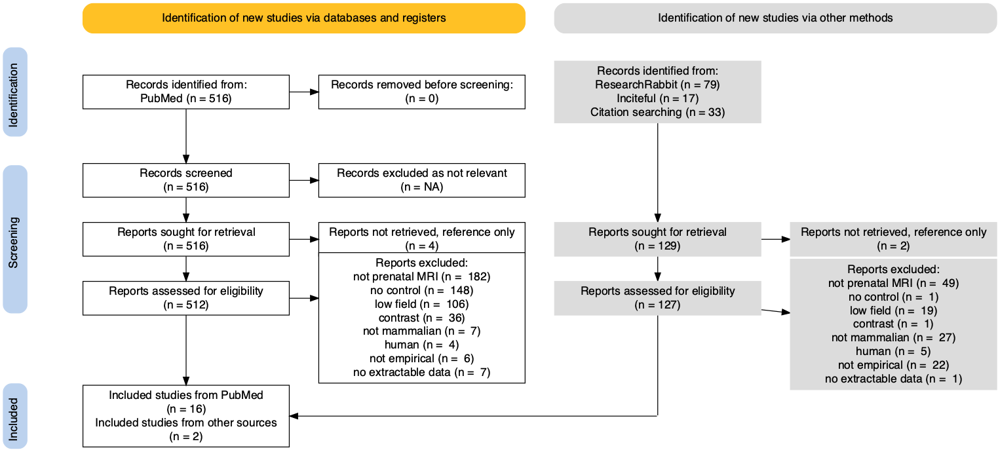

```{r setup, include=FALSE}
knitr::opts_chunk$set(echo = FALSE)
#devtools::install_github("MathiasHarrer/dmetar")
library(dmetar)
library(metafor)
library(meta)
library(tidyverse)
theme_set(theme_bw(base_size = 12,base_family = "Arial")); theme_update(panel.grid.minor = element_line(linetype = "dashed",size=.5),axis.title.x = element_text(face = "bold"),axis.title.y = element_text(face = "bold"))
```


```{r, include=FALSE}
p <- PRISMA2020::PRISMA_data(data = read.csv2(file = "data/PRISMA2020_FlowData.csv",header = T,sep = ",",na.strings = "NA"))
pp<- PRISMA2020::PRISMA_flowdiagram(data = p,previous = F,interactive = F,other = T,side_boxes = T,fontsize = 14)
PRISMA2020::PRISMA_save(plotobj = pp,filename = "figs/FigureS1.png",filetype = "PNG",overwrite = T)
```

{width=50%}


```{r load data, include=FALSE}
#load data
df <- read.csv2(file = "data/prenatalMRI_data.csv",header = T,sep = ",",na.strings = "NA",strip.white = T)
```

```{r format data, include=FALSE}
#clean df
df <- df %>% drop_na(outcome) %>% dplyr::select(-notes,-selection,-source)

#as numeric
df[,c("hours","Tesla","un_M","un_SD","ex_M","ex_SD")] <- sapply(df[,c("hours","Tesla","un_M","un_SD","ex_M","ex_SD")],  function(x) as.numeric(as.character(x)))

# N for litter size and prematurity should be N mom
df[df$outcome=="Litter Size",c("un_babies","ex_babies")] <- df[df$outcome=="Litter Size",c("un_moms","ex_moms")]
df[df$outcome=="Gestational Age",c("un_babies","ex_babies")] <- df[df$outcome=="Gestational Age",c("un_moms","ex_moms")]
df[df$outcome=="embryogenesis",c("un_babies","ex_babies")] <- df[df$outcome=="embryogenesis",c("un_moms","ex_moms")]

# binarize adult vs. perinatal outcomes
df$outcome_stage <- ifelse(df$outcome_timing_dpp>1,"adult","perinatal")

# binarize exposure length
df$exposurerealistic <- ifelse(df$hours>2,"long","short")

# binarize exposure timing
df$exposuretiming <- ifelse(df$exposure_dpc<5,"early","late")


# Author + year
df$AuthorYear <- paste(df$Author,df$Year,sep=" ")
df$StudyRef <- paste(str_c("(",df$study,")"),df$Author,df$Year,sep=" ")


x <- df %>% group_by(study) %>%  dplyr::select(un_moms,ex_moms,un_babies,ex_babies) %>% summarize_all(max) %>% ungroup() %>% colSums()
x1 <- df %>% filter(outcome_stage=="perinatal")%>% group_by(study) %>%  dplyr::select(un_moms,ex_moms,un_babies,ex_babies) %>% summarize_all(max) %>% ungroup() %>% colSums()
x2 <- df %>% filter(outcome_stage=="adult")%>% group_by(study) %>%  dplyr::select(un_moms,ex_moms,un_babies,ex_babies) %>% summarize_all(max) %>% ungroup() %>% colSums()

```


## Results
`r NROW(unique(df$AuthorYear))` publications examining prenatal MRI exposure among rodents were meta-analyzed. This included including k=`r NROW(df)` outcomes assessed across n=`r as.character(x[2])` unexposed dams, n=`r as.character(x[3])` exposed dams, n=`r as.character(x[4])` unexposed offspring, n=`r as.character(x[5])` exposed offspring.  


```{r ES, include=FALSE}
rm(x)
# estimate effect sizes with metafor
#standardized mean difference (SMD) --> negative = worse outcomes for exposed
#for continuous variables
EScon1 <- escalc(data=df %>% filter(out_binary=="n", out_better=="n"),measure="SMD", var.names = c("ES","seTE"), 
                 m1i=un_M, sd1i=un_SD, n1i=un_babies, 
                 m2i=ex_M, sd2i=ex_SD, n2i=ex_babies)
#for continuous variables, more is better (flip so negative SMD is worse for exposed)
EScon2 <- escalc(data=df %>% filter(out_binary=="n", out_better=="y"),measure="SMD", var.names = c("ES","seTE"), 
                 m1i=ex_M, sd1i=ex_SD, n1i=ex_babies,
                 m2i=un_M, sd2i=un_SD, n2i=un_babies)
#for out_binary variables
ESbin1 <- escalc(data=df %>% filter(out_binary=="y", out_better=="n") ,measure="OR2DL", var.names = c("ES","seTE"), 
                 ci=un_pos, di=un_neg, n2i=un_babies, 
                 ai=ex_pos, bi=ex_neg, n1i=ex_babies,to = "all", add =1/2)
#for out_binary variables, more is better (flip so negative SMD is worse for exposed)
ESbin2 <- escalc(data=df %>% filter(out_binary=="y", out_better=="y") ,measure="OR2DL", var.names = c("ES","seTE"), 
                 ci=ex_pos, di=ex_neg, n2i=ex_babies, 
                 ai=un_pos, bi=un_neg, n1i=un_babies)

#bind all together
df <- rbind(EScon1,EScon2,ESbin1,ESbin2) 
df <- df %>% arrange(es.id)
df <- df %>% dplyr::arrange(study)
rm(EScon1,EScon2,ESbin1,ESbin2)

```


```{r, include=FALSE,warning=F}

# main multi-level meta-analysis: using all outcomes, cluster within study
m.gen <- meta::metagen(TE = ES,seTE = seTE,
                 n.e = ex_babies,n.c = un_babies,
                 studlab = AuthorYear,
                 data = df,cluster = AuthorYear,prediction = T,
                 sm = "SMD",
                 fixed = FALSE, 
                 random = TRUE, method.ci = "t",
                 method.tau = "REML",
                 hakn = TRUE)
#summary(m.gen)

```


A multi-level model clustering effect sizes for multiple outcomes within publication found no evidence for an effect of prenatal MRI exposure (SMD=`r round(m.gen$TE.random,2)`, 95%CI=`r round(m.gen$lower.random,2)`,`r round(m.gen$upper.random,2)`, t=`r round(m.gen$statistic.random,2)`, p=`r round(m.gen$pval.random,2)`; Figure S2), i.e., a non-significant and small effect size (`r round(m.gen$TE.random,2)`SD difference in means) in the direction of better outcomes for the exposed group.

There was substantial heterogeneity in effect size (I2=`r 100*round(m.gen$I2,2)`%; between-studies τ2= `r round(m.gen$tau2[1],2)` 95%CI=`r round(m.gen$lower.tau2[1],2)`, `r round(m.gen$upper.tau2[1],2)`; within-studies τ2= `r round(m.gen$tau2[2],2)` 95%CI=`r round(m.gen$lower.tau2[2],2)`, `r round(m.gen$upper.tau2[2],2)`).

```{r Figure S2,include=FALSE,warning=F}
png(filename = "figs/FigureS2.png", height = 50, width = 30,units = "cm",res = 75)
meta::forest.meta(m.gen, xlim = "symmetric",weight.study = "random",studlab = T,random = T,
            print.tau2 = FALSE,prediction = T,pooled.totals = F,ref = 0,
            leftcols = c("cluster","outcome", "n.c", "n.e","effect","ci"), leftlabs = c("Study","Outcome", "N.c", "N.e", "SMD","95%CI"),
            rightcols = F,JAMA.pval = T,zero.pval = F,col.diamond = "blue",
            test.overall = T,hetstat = T,overall.hetstat = T,fs.smlab = 0,
            label.left = "Worse",label.right = "Better",col.label.left = "darkred",col.label.right = "darkgreen")
dev.off()
```

{width=50%}


```{r aggregated by study, include=FALSE}
res<-rma.mv(data=df,
            yi = ES, V = seTE,  verbose = F,slab = paste(AuthorYear,outcome,sep=" "), 
            method = "REML", test="t", random = ~ 1 | study/es.id) 
agg <- aggregate(df, cluster=AuthorYear, V=vcov(res, type="obs"), addk=TRUE)

m.agg <- metagen(TE = ES,
                 seTE = seTE,
                 studlab = StudyRef,
                 data = agg,
                 sm = "SMD",
                 fixed = FALSE,
                 random = TRUE,
                 method.tau = "REML",
                 hakn = TRUE)
#summary(m.agg)
png(filename = "figs/Figure1.png", height = 30, width = 20,units = "cm",res = 75)
forest.meta(m.agg, xlim = "symmetric",weight.study = "random",studlab = T,random = T,
            print.tau2 = FALSE,prediction = T,pooled.totals = F,ref = 0,
            leftcols = c("studlab", "ki","effect","ci"), leftlabs = c("Study","N outcomes" , "SMD","95%CI"),
            rightcols = F,JAMA.pval = T,zero.pval = F,col.diamond = "blue",
            test.overall = T,hetstat = T,overall.hetstat = T,fs.smlab = 0,
            label.left = "Worse",label.right = "Better",col.label.left = "darkred",col.label.right = "darkgreen")

dev.off()

```


```{r bias, include=FALSE,warning=F}
e <- metabias(m.gen, method.bias = "linreg",plotit = F)
```

We do not see clear evidence of publication bias; the effect sizes were not significantly related to the size of their standard error (Figure S3; Egger’s test: t(`r round(e$df,0)`) = `r round(e$statistic,2)`, p=`r round(e$p.value,2)`). 

```{r Figure S3,warning=F, include=FALSE}
png(filename = "figs/FigureS3a.png", height = 15, width = 20,units = "cm",res = 75)
meta::funnel.meta(m.gen, contour = c(0.9, 0.95, 0.99, .999),
            col.contour =  c("gray65","gray75", "gray85", "gray95"))
dev.off()

png(filename = "figs/FigureS3b.png", height = 15, width = 20,units = "cm",res = 75)
meta::metabias(m.gen, method.bias = "linreg",plotit = T)
dev.off()

```


{width=50%}
{width=50%}


```{r influence, include=FALSE}
i <- dmetar::InfluenceAnalysis(m.gen)

m.genINF <- metagen(TE = ES,seTE = seTE, subset = -c(which(i$Data$dffits >  3 * sqrt(1/NROW(df)))),
                    n.e = ex_babies,n.c = un_babies,
                    studlab = AuthorYear,
                    data = df,cluster = AuthorYear,prediction = T,
                    sm = "SMD",
                    fixed = FALSE, 
                    random = TRUE, method.ci = "t",
                    method.tau = "REML",
                    hakn = TRUE)
#summary(m.genINF)
```

Examining influence statistics and omitting n=`r sum(i$Data$dffits >  3 * sqrt(1/NROW(df)))` effects with high influence (DFFITS>`r round(3 * sqrt(1/NROW(df)),2)`) did not change the results meaningfully (SMD=`r round(m.genINF$TE.random,2)`, 95%CI=`r round(m.genINF$lower.random,2)`,`r round(m.genINF$upper.random,2)`, t=`r round(m.genINF$statistic.random,2)`, p=`r round(m.genINF$pval.random,2)`.


```{r moderators, include=FALSE}
#m.gen.mods <- metareg(m.gen, ~Year+outcome_stage+exposurerealistic+Tesla+control_condition)
m.gen.mods <- metareg(m.gen, ~Year+outcome_stage+exposurerealistic+Tesla+control_condition)
#summary(m.gen.mods)

summary(metareg(m.gen, ~Year))
summary(metareg(m.gen, ~exposurerealistic))
  summary(metareg(m.gen, ~hours))
summary(metareg(m.gen, ~Tesla))
summary(metareg(m.gen, ~control_condition))
summary(metareg(m.gen, ~exposuretiming))
  summary(metareg(m.gen, ~exposure_dpc))

s <- df %>% dplyr::select(study,exposure_dpc,exposuretiming,exposuretiming,exposurerealistic) %>% distinct()
table(s$exposure_dpc<10)
table(s$exposuretiming,s$exposurerealistic)


png(filename = "figs/FigureS5a.png", height = 12, width = 12,units = "cm",res = 75)
bubble(metareg(m.gen, ~Year), xlab = "Publication Year",col.line = "black")
dev.off()

png(filename = "figs/FigureS5b.png", height = 12, width = 12,units = "cm",res = 75)
bubble(metareg(m.gen, ~hours),xlab = "Scan Length (hours)",lwd = 2,col.line = "black", bg = ifelse(df$exposurerealistic=="long","#00BFC4","#F8766D"))
dev.off()

png(filename = "figs/FigureS5c.png", height = 12, width = 12,units = "cm",res = 75)
bubble(metareg(m.gen, ~Tesla),xlab = "Field Strength (Tesla)",lwd = 2,col.line = "black", bg = ifelse(df$Tesla>3,"#00BFC4","#F8766D"))
dev.off()

png(filename = "figs/FigureS5d.png", height = 12, width = 12,units = "cm",res = 75)
bubble(metareg(m.gen, ~control_condition),xlab = "Control Condition",lwd = 2,col.line = "black")
dev.off()

png(filename = "figs/FigureS5e.png", height = 12, width = 12,units = "cm",res = 75)
bubble(metareg(m.gen, ~exposure_dpc),xlab = "Exposure Timing (days postpartum)",lwd = 2,col.line = "black", bg = ifelse(df$exposuretiming=="late","#00BFC4","#F8766D"))
dev.off()

png(filename = "figs/FigureS5f.png", height = 12, width = 12,units = "cm",res = 75)
bubble(metareg(m.gen, ~outcome_timing_dpp),xlab = "Outcome Timing (days postpartum)",lwd = 2,col.line = "black", bg = ifelse(df$outcome_stage=="adult","#00BFC4","#F8766D"))
dev.off()


#summary(metareg(m.gen, ~exposure_dpc))
```

```{r split agg, include=F}

res.p<-rma.mv(data=df %>% filter(outcome_stage=="perinatal"), 
            yi = ES, V = seTE,  verbose = F,slab = paste(AuthorYear,outcome,sep=" "), 
            method = "REML", test="t", random = ~ 1 | study/es.id) 
res.a<-rma.mv(data=df %>% filter(outcome_stage=="adult"), 
              yi = ES, V = seTE,  verbose = F,slab = paste(AuthorYear,outcome,sep=" "), 
              method = "REML", test="t", random = ~ 1 | study/es.id) 
agg.p <- aggregate(df %>% filter(outcome_stage=="perinatal"), cluster=paste(AuthorYear,outcome_stage), V=vcov(res.p, type="obs"), addk=TRUE)
agg.a <- aggregate(df %>% filter(outcome_stage=="adult"), cluster=paste(AuthorYear,outcome_stage), V=vcov(res.a, type="obs"), addk=TRUE)

m.agg.p <- metagen(TE = ES,
                 seTE = seTE,
                 studlab = AuthorYear,sm = "SMD",fixed = FALSE,random = TRUE,method.tau = "REML",hakn = TRUE,
                 data = agg.p)
m.agg.a <- metagen(TE = ES,
                   seTE = seTE,
                   studlab = AuthorYear,sm = "SMD",fixed = FALSE,random = TRUE,method.tau = "REML",hakn = TRUE,
                   data = agg.a)

png(filename = "figs/FigureS4a.png", height = 20, width = 20,units = "cm",res = 75)
forest.meta(m.agg.p, xlim = "symmetric",weight.study = "random",studlab = T,random = T,
            print.tau2 = FALSE,prediction = T,pooled.totals = F,ref = 0,
            leftcols = c("studlab","ki","effect","ci"), leftlabs = c("Study","N Outcome",  "SMD","95%CI"),
            rightcols = F,JAMA.pval = T,zero.pval = F,col.diamond = "blue",
            test.overall = T,hetstat = T,overall.hetstat = T,fs.smlab = 0,
            label.left = "Worse",label.right = "Better",col.label.left = "darkred",col.label.right = "darkgreen")
dev.off()
png(filename = "figs/FigureS4b.png", height = 20, width = 20,units = "cm",res = 75)
forest.meta(m.agg.a, xlim = "symmetric",weight.study = "random",studlab = T,random = T,
            print.tau2 = FALSE,prediction = T,pooled.totals = F,ref = 0,
            leftcols = c("studlab","ki","effect","ci"), leftlabs = c("Study","N Outcome",  "SMD","95%CI"),
            rightcols = F,JAMA.pval = T,zero.pval = F,col.diamond = "blue",
            test.overall = T,hetstat = T,overall.hetstat = T,fs.smlab = 0,
            label.left = "Worse",label.right = "Better",col.label.left = "darkred",col.label.right = "darkgreen")
dev.off()

```


In a meta-regression, only the age at which outcomes were assessed was a trend-level significant predictor (b=`r round(m.gen.mods$beta[3],2)`, 95%CI=`r round(m.gen.mods$ci.lb[3],2)`,`r round(m.gen.mods$ci.ub[3],2)`, t(`r round(m.gen.mods$ddf[3],0)`)=`r round(m.gen.mods$zval[3],2)`, p=`r round(m.gen.mods$pval[3],2)`); ns. for publication year, exposure length, field strength, control condition); such that perinatal outcomes had a SMD closer to zero compared to higher SMD among adult outcomes (adult outcomes k=`r m.agg.a$k.study`; SMD=`r round(m.agg.a$TE.random,2)`, 95%CI=`r round(m.agg.a$lower.random,2)`,`r round(m.agg.a$upper.random,2)`, t=`r round(m.agg.a$statistic.random,2)`, p=`r round(m.agg.a$pval.random,2)`; perinatal outcomes k=`r m.agg.p$k.study`; SMD=`r round(m.agg.p$TE.random,2)`, 95%CI=`r round(m.agg.p$lower.random,2)`,`r round(m.agg.p$upper.random,2)`, t=`r round(m.agg.p$statistic.random,2)`, p=`r round(m.agg.p$pval.random,2)`; Figure S4). 


{width=50%}
{width=50%}


```{r by type, include=FALSE}
m.gen.type <- metagen(TE = ES,seTE = seTE,
                      subgroup = outcome,data = df %>% filter(outcome %in% c("Birth Weight","Inviability","Litter Size","Malformations")),
                       n.e = ex_babies,n.c = un_babies,
                       studlab = AuthorYear,
                       cluster = AuthorYear,prediction = T,
                       sm = "SMD",
                       fixed = FALSE, 
                       random = TRUE, method.ci = "t",
                       method.tau = "REML",
                       hakn = TRUE)
#summary(m.gen.type)
```


Similarly, no significant meta-analytic effects were observed when focusing on the four most commonly reported outcomes: birth weight (n = `r m.gen.type$k.all.w[2]`, SMD=`r round(m.gen.type$TE.random.w[2],2)`, 95%CI=`r round(m.gen.type$lower.random.w[2],2)`,`r round(m.gen.type$upper.random.w[2],2)`), litter size (n=`r m.gen.type$k.all.w[1]`, SMD=`r round(m.gen.type$TE.random.w[1],2)`, 95%CI=`r round(m.gen.type$lower.random.w[1],2)`,`r round(m.gen.type$upper.random.w[1],2)`),  fetal inviability (n=`r m.gen.type$k.all.w[3]`, SMD=`r round(m.gen.type$TE.random.w[3],2)`, 95%CI=`r round(m.gen.type$lower.random.w[3],2)`,`r round(m.gen.type$upper.random.w[3],2)`), or physical malformations (n=`r m.gen.type$k.all.w[4]`, SMD=`r round(m.gen.type$TE.random.w[4],2)`, 95%CI=`r round(m.gen.type$lower.random.w[4],2)`,`r round(m.gen.type$upper.random.w[4],2)`).
